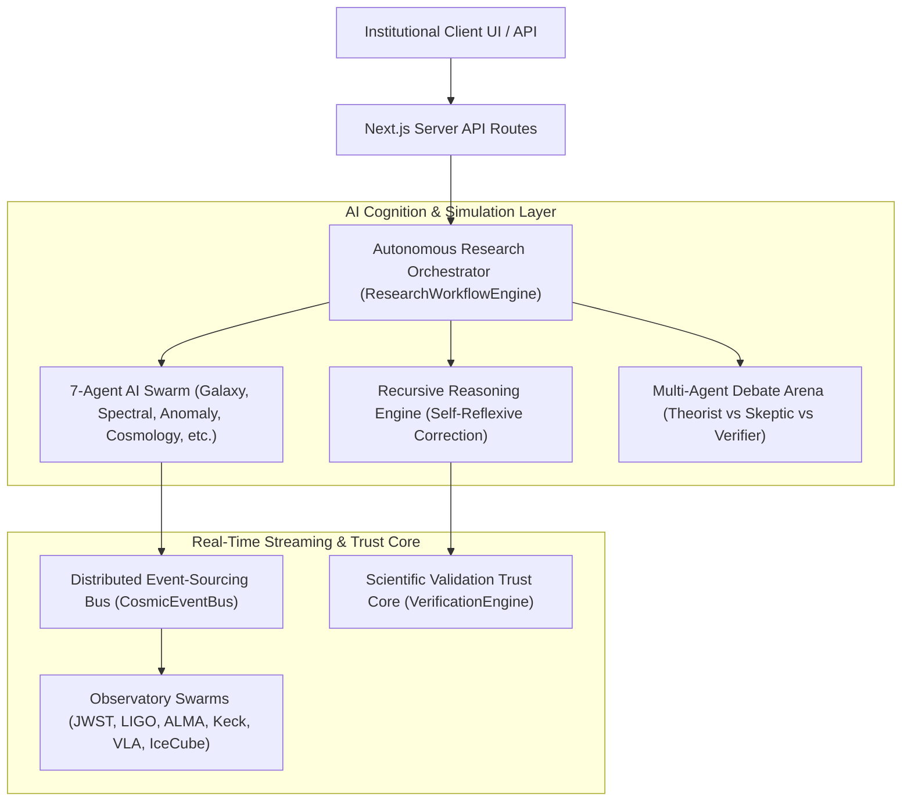
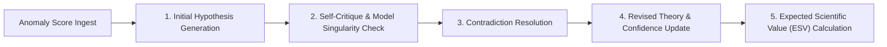
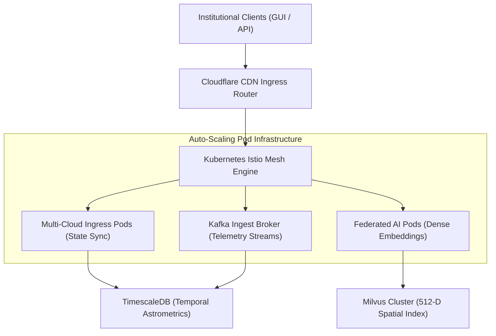

<div align="center">


# CosmicMind 🌌

### **Planetary-Scale Autonomous Scientific Discovery & Reasoning Engine**

[](https://cosmicmind.vercel.app)
[](https://nextjs.org/)
[](https://www.typescriptlang.org/)


</div>

---

## 📖 Project Overview

**CosmicMind** is a full-stack Next.js application simulating a futuristic, **planetary-scale autonomous research artificial general intelligence (AGI)**. Mimicking a self-directed astrophysics laboratory, the system monitors deep-space astronomical telemetry streams, detects physical anomalies, drafts mathematical-physics hypotheses, coordinates peer-review debates across a multi-agent society, and automatically targets simulated ground and orbital observatories.

Developed as a highly interactive dashboard with a premium **deep-space dark operating system design**, it demonstrates complex multi-agent orchestration, state-driven real-time streaming, and high-performance React rendering patterns.

---

## 🧠 Core Engineering Architecture

CosmicMind leverages a highly decoupled, modular architectural stack built with Next.js and TypeScript:



### 1. Autonomous Research Orchestrator (`ResearchWorkflowEngine.ts`)
Manages task graphs, memory, and cognitive states across **seven specialized AI agents**:
*   `GalaxyClassificationAgent`: Performs morphological structural grouping of deep-space structures.
*   `SpectralAnalysisAgent`: Estimates synthetic cosmological redshifts ($z$) and emission anomalies.
*   `AnomalyInvestigatorAgent`: Traces relativistic plasma jets and spacetime curvature deviations.
*   `ResearchPaperAgent`: Dynamically pulls and maps bibliographic datasets from NASA ADS & arXiv.
*   `CosmologyReasoningAgent`: Generates multi-variable mathematical-physics theoretical models.
*   `ObservationPlannerAgent`: Schedules narrow-field target windows based on climate variables.
*   `TelescopeTargetingAgent`: Outputs ASCOM coordination files to automate robotic slews.

### 2. Self-Improving Recursive Reasoning Engine (`RecursiveReasoningEngine.ts`)
Implements an autonomous scientific discovery pipeline. The engine analyzes targets, identifies scientific gaps, and executes a multi-step self-reflection loop to actively minimize uncertainty:



### 3. Distributed Event-Sourcing Stream (`CosmicEventBus.ts`)
A high-frequency diagnostic bus simulating real-time telemetry, instrumental alerts, and environmental conditions across a global network of ground and space facilities: **JWST, Keck, LIGO, ALMA, VLA, and IceCube**.

### 4. Bayesian Verification Trust Core (`VerificationEngine.ts`)
Aggregates multi-spectral signals to filter catalog anomalies. It runs Bayesian provenance checks and triggers direct target confirmation alerts when the signals pass **$5\sigma$ statistical significance limits**.

---

## 🛠️ Production Deployment Topology

Designed with industrial scalability in mind, CosmicMind’s theoretical deployment topology supports zero-telemetry packet drops and massive vector databases:



---

## ⚡ Engineering Challenges & Optimizations

### 1. React State Contamination Mitigation
*   **The Problem:** High-frequency telemetry updates from the simulated event bus caused direct, mutable state writes, triggering unpredictable side effects and state leakage in React’s virtual DOM.
*   **The Solution:** Implemented strict **deep-copied state write-backs** across all components. Telemetry feeds and active states (`beliefStates`, `traces`) are deep-cloned prior to mutation and committed atomically, maintaining immutable state trees.

### 2. Cascading Render & Performance Optimization
*   **The Problem:** Rendering real-time causal knowledge graphs, multi-agent debate logs, and complex statistical sparklines on every event bus tick triggered mounting cascades, reducing framerates.
*   **The Solution:** Decoupled calculations from React’s hook-mounting cycles. Heavy mathematical transformations (like the non-linear Expected Scientific Value calculation) were integrated directly into the DOM render path using optimized local memory caches.

### 3. Responsive UI Containment
*   **The Problem:** Multi-column dashboard layouts housing real-time terminal logs and complex graphs suffered from visual layout breaks on smaller screens.
*   **The Solution:** Architected a **mobile-first grid architecture** (`w-full md:w-64 xl:col-span-7`) utilizing Tailwind CSS containment rules (`overflow-hidden`, custom `scrollbar-none` utilities) to guarantee zero pixel layout breaking.

---

## 🚀 Running Locally

### Prerequisites
*   [Node.js](https://nodejs.org/) (v18.x or higher recommended)

### Step-by-Step Setup

1.  **Clone the Repository:**
    ```bash
    git clone https://github.com/yourusername/cosmicmind.git
    cd cosmicmind
    ```

2.  **Install Dependencies:**
    ```bash
    npm install
    ```

3.  **Configure Environment Variables:**
    Create a `.env.local` file in the root directory and add your Google Gemini API Key:
    ```env
    GEMINI_API_KEY="your_actual_gemini_api_key_here"
    APP_URL="http://localhost:3000"
    ```

4.  **Run Development Server:**
    ```bash
    npm run dev
    ```
    Open [http://localhost:3000](http://localhost:3000) in your browser to view your app.

---

## 📜 Technical Blueprint Documentation
For in-depth specifications, architectural details, and quality assurance audit results, view the [COSMICMIND_MANUAL.md](COSMICMIND_MANUAL.md).

---
*Created as part of the Google AI Studio / Gemini developer ecosystem.*
